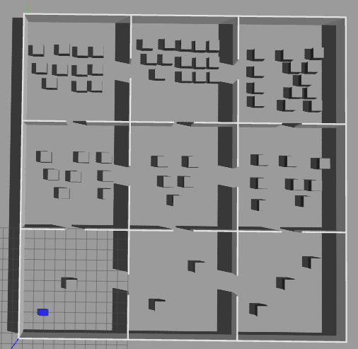

# Multi-Map Navigation with Wormholes

<kbd>  </kbd>

[View Demo Video](https://drive.google.com/file/d/12SjEAlQ3jb8CdyYlcRdcOOtHJsZIajHm/view?usp=sharing)

A ROS package that enables seamless navigation across multiple maps using wormholes (predefined transformation points). Ideal for environments split into separate maps (like rooms or floors), this package teleports the robot between maps while maintaining localization.

---

## 🚀 Features
- Action server/client interface for goal navigation.
- `move_base` based multi map navigation action server.
- Wormhole-based teleportation between maps.
- `SQLite` database to store wormhole locations.

---

## 🔍 Wormholes: How It Works
Wormholes are defined as shared poses between two maps. The robot uses these as teleportation anchors during navigation between maps.

The server checks for a wormhole connection:
- If current map == target map: navigates directly.
- If different: navigates to wormhole, switches map, teleports to the corresponding wormhole pose in new map, and navigates to final goal.

---

##  Functionality

It includes:
- **`MultiMapGoalActionServer`** – A ROS action server that handles navigation goals across maps.
- **`multi_map_goal_client`** – A command-line tool to send navigation goals to the server.

### `MultiMapGoalActionServer`

- Listens for goals that include:
  - Target pose `(x, y, yaw)`
  - Target map name (e.g., `"room1"`, `"lab2"`)
- Checks if robot needs to **switch maps**.
  - If yes: queries wormhole info from an SQLite DB.
  - Publishes the new map path → triggers map switch.
  - Publishes robot's initial pose in new map frame.
- Sends goal to `move_base` once localization is stable.
- Reports success or failure through action result.

### `multi_map_goal_client`

- A simple CLI-based goal sender.
- Takes four inputs: `x`, `y`, `yaw`, `map_name`
- Sends an action goal to `MultiMapGoalActionServer`
- Waits for result and prints status

---

## 📂 Package Structure
```
multimap_nav/
├── CMakeLists.txt
├── package.xml
├── README.md              
├── action/
│   └── SendGoal.action   
├── data/
│   ├── wormholes.db     
│   └── wormholes.sql    
├── include/multimap_nav/
│   └── MultiMapGoalActionServer.hpp
├── src/
│   ├── MultiMapGoalActionClient.cpp
│   └── MultiMapGoalActionServer.cpp
```

---


## 🌐 Dependencies
- ROS (tested on Noetic)
- move_base
- AMCL
- sqlite3

---

## ⚖️ Installation and Building with Additional Packages

### ☁️ Cloning 

```
cd ~/catkin_ws/src

# Multi Map Navigation Package
git clone https://github.com/manojm-dev/multimap_nav.git

# AR100
git clone https://github.com/manojm-dev/AR100.git
```

### 📦 Installing Dependencies

```
cd ~/catkin_ws
sudo apt-get update -y && rosdep update && rosdep install --from-paths src --ignore-src -y
```

### 🛠️ Building

```bash
cd ~/catkin_ws
catkin_make
source devel/setup.bash
```

---


## ⚙️ Usage

### 1. Start the Simulation

```
roslaunch start_anscer start_anscer.launch
```

### 2. Start the Autonomous Navigation Stack
```
roslaunch anscer_navigation anscer_navigation.launch map_name:=room1
```
> room1 is the spawning location for the robot and don't forget to localize the robot in rviz before proceding with running action server.

### 3. Start the Action Server
```bash
rosrun multimap_nav multi_map_goal_server
```
> Ensure that parameters such as `wormhole_db`, `maps_path`, and others are correctly set via the launch file or the parameter server. If any related files or configurations are modified, update these parameters accordingly to maintain seamless functionality.

### 2. Send Navigation Goal
```bash
rosrun multimap_nav multi_map_goal_client <x> <y> <yaw> <map_name>
```

Example:
```bash
rosrun multimap_nav multi_map_goal_client 1.0 2.5 1.57 room2
```

---


## 🚫 Limitations
- No support for dynamic map generation.
- Wormholes must be manually defined.
- Assumes perfect localization post-teleport (relies on AMCL recovery).


---


## 📅 Future Improvements
- Auto-generation of wormhole candidates.
- Dynamic graph-based multi-map planning.
- GUI for wormhole editing and DB management.

---

